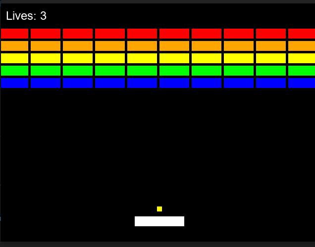

# CPlusEngine

A cross-platform 2D game engine built with C++ and SDL3.

**Author:** William de Try ([@NoticeableSmeh](https://github.com/NoticeableSmeh))



## Features

- **Cross-platform** - Runs on Windows, macOS, and Linux
- **SDL3-powered** - Modern graphics, audio, and input handling
- **Modular architecture** - Separate engine core from game code
- **Sprite system** - Static, moving, and animated sprites
- **Scene management** - Organize game objects efficiently
- **Audio support** - Music and sound effects via SDL3
- **Text rendering** - TrueType font support with SDL3_ttf

## Prerequisites

- CMake 3.20+
- C++17 compatible compiler (GCC, Clang, MSVC)
- SDL3
- SDL3_image
- SDL3_ttf

### Installing Dependencies

**Ubuntu/Debian:**
```bash
sudo apt-get install cmake build-essential libsdl3-dev libsdl3-image-dev libsdl3-ttf-dev
```

**macOS (Homebrew):**
```bash
brew install cmake sdl3 sdl3_image sdl3_ttf
```

**Windows:**
Download SDL3 development libraries from [libsdl.org](https://www.libsdl.org/)

## Building

```bash
cmake -B build -DCMAKE_BUILD_TYPE=Release
cmake --build build -j
```

## Running

```bash
./build/bin/CPlusEngine
```

## Development

After making changes, rebuild with:
```bash
cmake --build build -j
```

Clean rebuild:
```bash
rm -rf build
cmake -B build -DCMAKE_BUILD_TYPE=Release
cmake --build build -j
```

## Project Structure

```
CPlusEngine/
├── engine/             # Core engine library
│   ├── include/
│   │   ├── core/      # Window, Renderer, GameEngine
│   │   ├── graphics/  # Sprite, AnimatedSprite, TextSprite
│   │   ├── audio/     # AudioManager
│   │   ├── input/     # InputManager, TextInputField
│   │   └── scene/     # Scene management
│   └── src/           # Engine implementation
├── game/              # Game code
│   ├── include/       # Breakout.h (example game)
│   └── src/           # Breakout.cpp, main.cpp
├── assets/            # Game resources
│   ├── images/
│   ├── sounds/
│   └── fonts/
└── CMakeLists.txt     # Build configuration
```

## Creating Your Own Game

1. Add your game class in `game/include/YourGame.h`
2. Implement it in `game/src/YourGame.cpp`
3. Update `main.cpp` to use your game class
4. Add your assets to the `assets/` directory
5. Rebuild and run!

## License

MIT License - See [LICENSE](LICENSE) file for details.

## Credits

**CPlusEngine** created by William de Try ([@NoticeableSmeh](https://github.com/NoticeableSmeh))

Built with [SDL3](https://www.libsdl.org/) - Simple DirectMedia Layer

---

